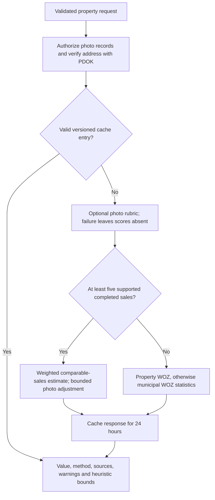

# AI engineering

[Documentation](README.md) · [Architecture](architecture.md) · [Estimator method](../estimator/METHOD.md)

ZelfWonen demonstrates AI integration within a stateful product: structured model
outputs feed ordinary application workflows, while numeric valuation remains in
a separate deterministic service. There is no custom foundation-model training,
vector database or retrieval-augmented generation pipeline in these paths.

## Three AI features

| Feature | Model output and downstream use | Evidence |
| --- | --- | --- |
| Listing assistant | Dutch/English title and description proposals, validated against a Zod output schema and reviewed by the owner. The prompt asks for factual copy without invented property or legal claims. | [Route and prompt](../web/src/app/api/ai/listing-description/route.ts) |
| Natural-language search | Structured fields such as location, purpose, budget and amenities. Enum validation, numeric caps and range normalization precede URL-filter construction; the existing marketplace code builds the database query. | [Interpreter](../web/src/features/listings/ai-search.ts), [route](../web/src/app/api/ai/search/route.ts) |
| Photo condition | Nullable 1–5 rubric scores, confidence and visible evidence. These become optional inputs to Python rather than an LLM-generated property price. | [Orchestrator and prompt](../web/src/features/estimator/service.ts), [schemas](../web/src/lib/schemas/estimator.ts) |

Schema validation constrains output shape, not factual correctness. Owners should
review generated copy and users should inspect interpreted filters. Prompt rules
against invented facts or instructions embedded in images are mitigations, not
guarantees.

## Provider selection, cost and failure behavior

The shared [OpenRouter adapter](../web/src/lib/integrations/openrouter.ts) uses the
Vercel AI SDK with an explicit provider instance. It first requests
`openrouter/auto` with low-cost routing and an allowlist of `:free` model IDs,
then tries the configured models directly in sequence after failure.

This reflects the project's limited funding. It does not guarantee zero provider
cost, model availability, multimodal capability or identical output across models.
The adapter catches failures broadly; it does not provide a full per-model
telemetry or spending-control system. The [admin dashboard](../web/docs/admin-dashboard.md)
can display key-scoped usage, but is not a spending enforcement mechanism.

| Failure | Application behavior |
| --- | --- |
| Writing provider missing or unavailable | Returns an unavailable response; manual editing remains possible. |
| Search provider unavailable | Falls back to ordinary text search; a Zod interpretation error returns 502. |
| Photo assessment fails | Continues with quantitative inputs only. |
| Estimator unhealthy, address unresolved or evidence unsupported | Returns an error/unavailable estimate instead of inventing a price. |

The AI search route is public and has no explicit route-level authentication or
rate limiter. Add abuse and request-budget controls before exposing it to
untrusted traffic.

## Valuation flow



Unsupported inputs, stale evidence or unavailable services can terminate the
flow without a value.

### Authorized inputs and bounded influence

Before photo assessment, the web service checks that each media record is
`READY` and belongs to the requesting user. It reads local file bytes and checks
their stored SHA-256 hashes before sending them to the provider. This avoids
fetching arbitrary caller-supplied remote image URLs. Property text and photos
used for assessment leave the application for the configured provider.

The prompt treats owner text as untrusted context, asks for null on unseen
dimensions, and excludes hidden defects, structural safety and occupant traits.
For the comparable-sales branch, Python confidence-weights the visible-condition
heuristic and caps its adjustment at ±4%. It cannot increase reported confidence.
WOZ branches apply no photo premium.

### Evidence hierarchy and uncertainty

[Python's national model](../estimator/app/national.py) chooses:

1. Local completed-sale comparables where enough suitable observations exist.
2. Owner-supplied property WOZ with an assessment year.
3. Municipal median WOZ per square metre, scaled by living area.

CBS indices adjust reference dates. The separate asking-price benchmark can flag
disagreement and widen bounds; it never becomes a sale-price training label or
changes the central estimate. Responses expose the method, evidence count,
sources, reference dates and warnings. Confidence is a support score; intervals
are heuristic and explicitly uncalibrated.

This is a nearest-comparable/statistical model, with no fitted regression model
or separate training job. Its nationwide fallback coverage must not be confused
with nationwide transaction-price accuracy.

### Caching and reproducibility

The 24-hour cache key includes normalized input, sorted image hashes, resolved
address context, rubric version and Python model/data version. Provider health
and address lookup occur before cache lookup. Artifact content hashes in the
Python version invalidate cached valuations when bundled evidence changes.

Photo inference requests temperature zero and an input-derived seed. These
settings and caching reduce variation; they do not make remote LLM inference
deterministic. The cache records a generic router/rubric label, not the exact
resolved provider model. A model-routing change alone does not invalidate that
key. Exact model provenance and a provider-aware cache version are further work.

## Evaluation and portfolio limits

The estimator ships 153 completed-sale observations in the Utrecht region, plus
public indices and nationwide statistical artifacts. Its
[forward evaluation](../estimator/scripts/evaluate.py) restricts comparable sales
to pre-cutoff records and evaluates later sales at their transaction dates.
Anonymized subject postcodes are excluded from their own comparable set.

Reproduce from `estimator/`:

```bash
uv sync --python 3.12
uv run python -m scripts.evaluate --cutoff 2024-07-01
```

Report estimation coverage alongside error: unsupported homes remain in the
coverage denominator, while error and bound coverage use supported predictions.
The [estimator README](../estimator/README.md#evaluation-and-limitations) records
the bundled-data result and its limitations. The dataset informed development;
it is not an untouched final validation set, and revised index vintages prevent
a strict point-in-time backtest.

Existing [web estimator tests](../web/tests/estimator.test.ts) cover orchestration
and [Python tests](../estimator/tests/) cover model/API/data behavior. They do not
establish LLM quality, prompt-injection resistance or national valuation accuracy.
A repeatable writing/search/vision evaluation corpus, exact inference provenance,
latency/cost measurements and broader independent valuation data remain useful
next steps. One visible search-prompt issue is that its “label A or better”
example includes lower energy labels; schema validity alone cannot catch that
semantic error.
