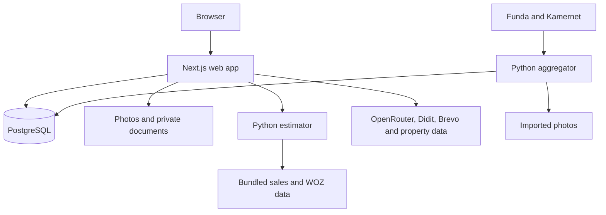

# Architecture

[Project overview](../README.md) · [Repository map](directory-structure.md)

zelf-wonen has three services. The Next.js web app handles user workflows,
the Python estimator provides price estimates, and the optional Python aggregator
imports external listings. The web app owns the PostgreSQL schema.

## Services

Docker Compose adds Caddy for HTTPS and public files. PostgreSQL and the estimator
are private in production. Files use persistent volumes on one host.
See [deployment](../web/docs/deployment.md) for storage and backups.

## Web application

- `src/app/` contains pages and API routes.
- `src/components/` contains the user interface.
- `src/features/` contains listing, bidding, identity and transaction rules.
- `src/lib/` contains shared validation, authentication, storage and provider adapters.
- `prisma/` defines database records and history protections.

Server code checks access before reading or changing protected data.
Better Auth handles sessions, email verification and optional two-factor authentication.

## Listings and identity

Owners need verified email, a ready listing and current Didit approval to publish.
Identity approval is reused across listings for 365 days by default.
Production accepts live approvals only. Sandbox and sample identities cannot
unlock production publication.

Identity verification does not prove ownership or sign agreements.
[Didit setup](../web/docs/didit-setup.md) explains credentials, the monthly cap
and failed verification attempts.

## Search, AI and estimates

Search combines native listings and active imports. Some filters exclude imports
when the required data is missing. Imported listings link to the source platform
for viewings, bids and transactions.

OpenRouter supports listing text, natural-language filters and optional photo
assessment. Owners review writing suggestions. Search output is validated before
it becomes database filters.

The estimator uses completed sales where supported, then property WOZ or municipal
WOZ statistics. It reads bundled files rather than PostgreSQL.
Values and ranges are indicative.
See the [estimator guide](../estimator/README.md) for the method and limitations.

PDOK, BAG, cadastral and energy-label lookups supply property information.
The [aggregator](../aggregator/README.md) normalizes external listings, downloads
photos and reuses the web app's neighborhood lookup.

## Files and transaction history

| Content | Access |
| --- | --- |
| Listing photos, floor plans and listing PDFs | Public, including draft uploads |
| Imported photos | Public |
| Transaction documents and agreement or dossier PDFs | Authorized transaction members |
| Bid logbook exports | Authorized logbook access |

Listing uploads are for marketing material. Private evidence belongs in a
transaction room. Uploads have type and size checks, but no malware scanning
or automatic EXIF removal.

Accepting a bid creates a room for the owner and accepted bidder. They can
exchange messages and documents, confirm terms and track milestones.
Property dossiers have versioned snapshots and PDF exports.
Digital agreement signing is unavailable.

Bid and transaction histories use hash chains and database rules that reject
changes to protected history records. These make inconsistent history detectable,
but do not provide immutable storage against a privileged administrator.

## Dashboards

The seeker dashboard brings together favorites, saved searches, viewings, bids,
transactions and in-app notifications. Shared shortlists use expiring, revocable
links. Private notes are included only when the creator opts in.

The [admin dashboard](../web/docs/admin-dashboard.md) shows usage and service metrics
for a configured account. It has no moderation tools.
