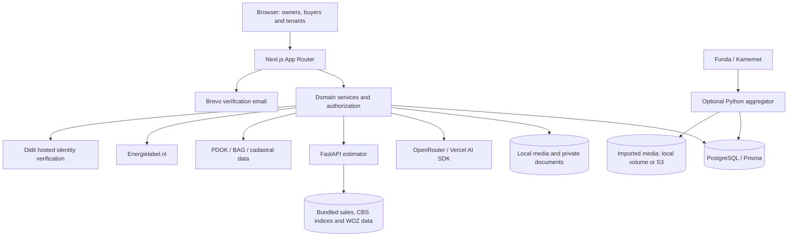

# Architecture

[Documentation](README.md) · [AI engineering](ai-engineering.md) · [Repository map](directory-structure.md)

ZelfWonen uses a Next.js modular monolith for the web application, an internal
Python valuation API and an optional Python listing-import worker. The web app
owns the shared PostgreSQL schema. The estimator reads bundled data files rather
than the application database.

## System overview

[Production Compose](../web/compose.yaml) adds Caddy for HTTPS and public files.
PostgreSQL and the estimator are private services. The deployment uses one web
host with persistent volumes; multiple web hosts would need shared file storage.
See [deployment and backups](../web/docs/deployment.md).

## Application boundaries

| Layer | Responsibility | Evidence |
| --- | --- | --- |
| App Router | Pages, HTTP input/output and route-level authorization | [app/](../web/src/app/) |
| Domain services | Listing, bidding, identity, estimator, seeker and transaction rules | [features/](../web/src/features/) |
| Provider adapters | OpenRouter, Didit and public property-data requests | [integrations/](../web/src/lib/integrations/) |
| Shared schemas | Zod API/domain validation; Python uses Pydantic models | [web schemas](../web/src/lib/schemas/), [Python schemas](../estimator/app/schemas.py) |
| Persistence | Prisma models, relational constraints and append-only SQL triggers | [schema](../web/prisma/schema.prisma), [triggers](../web/prisma/immutability.sql) |

React Server Components handle server-rendered surfaces; TanStack Query supports
interactive client workflows. Route handlers and domain services enforce access
on the server. A client-side visibility check is not an authorization boundary.

## Identity and publication

Better Auth handles accounts, sessions, email verification and optional TOTP.
Protected owner workflows require verified email. Public marketplace browsing
and the AI search endpoint are accessible without that gate; AI writing and
valuation require verified users.

Publication checks listing ownership, verified email, readiness and current
Didit verification. A per-listing advisory lock serializes publication with edits;
publication records and the listing's `LIVE` transition are written in a database
transaction with idempotency checks.

Didit sessions are reserved in the database before the provider request. The
application caps monthly reservations at 499, reuses pending sessions and caches
approved identities with a default 365-day lifetime. Signed webhooks are checked
against an authoritative provider response and the local attempt. Production
accepts live Didit records; sandbox and seeded records cannot unlock production.
Identity approval does not prove property ownership or sign an agreement.

Evidence: [auth guards](../web/src/features/auth/guards.ts),
[publication](../web/src/features/listings/publish-listing.ts),
[Didit service](../web/src/features/identity/didit-service.ts).
Operational details: [Didit setup](../web/docs/didit-setup.md).

## AI and valuation

LLMs produce writing proposals, structured search filters and visible-condition
scores. Python produces numeric valuations using a hierarchy of local completed
sales, supplied property WOZ and municipal WOZ statistics. Photo failure can
degrade to numeric-only estimation; insufficient evidence produces an unavailable
result. The [AI engineering guide](ai-engineering.md) covers prompts, validation,
caching, evaluation and the distinction between repeatable arithmetic and LLM output.

## Property data and imported listings

PDOK resolves addresses and BAG identifiers. BAG and cadastral WFS adapters
retrieve building and parcel details. Energy-label lookup is a best-effort
single-address Energielabel.nl request with stored-label fallback. These are
provider lookups, not an EP-Online ingestion pipeline.

The optional aggregator writes normalized listings, source links, raw payloads
and image metadata to the shared database. Its active sync path:

- refreshes details for every discovered listing;
- preserves existing source-to-master associations;
- allows new Funda records to match by postcode, positive house number and suffix;
- keeps other records source-specific, avoiding street-only merges and merging
  distinct Kamernet rooms at one address;
- marks confirmed 404/410 details offline, with absence-based expiry disabled by
  default and guarded when enabled.

The supplied production timer runs daily; the development loop defaults to six
hours. Both use a PostgreSQL advisory lock to prevent overlapping imports.
Live source access and completeness still need validation.

Imported properties are a discovery layer with links back to the source;
viewings, bids and transactions occur there. Native owner listings use ZelfWonen's
own workflows. See [sync code](../aggregator/app/sync.py) and the
[aggregator guide](../aggregator/README.md).

## Files and privacy boundaries

[Listing uploads](../web/src/app/api/listings/[listingId]/media/route.ts) check
ownership, editable state, supported file type, size (up to 20 MiB) and file
signatures. SHA-256 hashes accompany media records. The
[storage module](../web/src/lib/storage.ts) publishes complete files atomically
and refuses to overwrite an existing key.

| Storage | Access |
| --- | --- |
| Listing photos, floor plans and listing PDFs | Public, including draft uploads |
| Imported photos | Public local volume by default; optional S3 storage in the aggregator |
| Transaction documents and generated agreement/passport PDFs | Private storage, downloaded through authorized room access |
| Bid logbook PDFs | Private storage, returned through the authorized logbook API |

Owner uploads are direct multipart uploads to Next.js. Malware scanning, image
transcoding, EXIF removal and immutable object-lock archival are **not implemented**
in that upload path. Persistent volumes are not backups. The
[backup runbook](../web/docs/deployment.md#backup-and-restore) describes the supplied
single-VM scripts and off-server storage requirement.

## Bid history, transactions and passports

Bidding uses integer euro cents, per-listing database locks, canonical payloads
and SHA-256 hash chains. SQL triggers reject updates and deletes on the covered
history tables when installed. Generated logbooks retain hashes and chain heads.

Accepting a bid creates a transaction room for the owner and accepted bidder.
The workflow includes chat, private documents, agreement terms and confirmations,
sale/rental milestones, notary and handover details, and controlled completion or
cancellation. Versioned property-passport snapshots and transaction events are
hash-chained; PDF exports identify the dossier version.

These controls expose inconsistent history but do not stop a privileged operator
from replacing an entire chain. The local files do not provide immutable archival.
Digital signing is unavailable; agreement confirmations must not be presented as
a completed signing-provider integration.

Evidence: [bidding](../web/src/features/bidding/),
[transactions and passports](../web/src/features/transactions/).

## Seeker and operator dashboards

The seeker dashboard combines account favorites, saved searches, viewings, bids,
transactions and in-app notifications. Anonymous local favorites can be merged
after sign-in. Notification synchronization is triggered separately from dashboard
reads; an offline notification scheduler is additional operational work.

Shared shortlists use bearer tokens stored as hashes, with expiry and revocation.
Private notes are included only when the owner opts in.
The [operator dashboard](../web/docs/admin-dashboard.md) provides metrics for a
configured administrator; it is not a complete moderation system.
