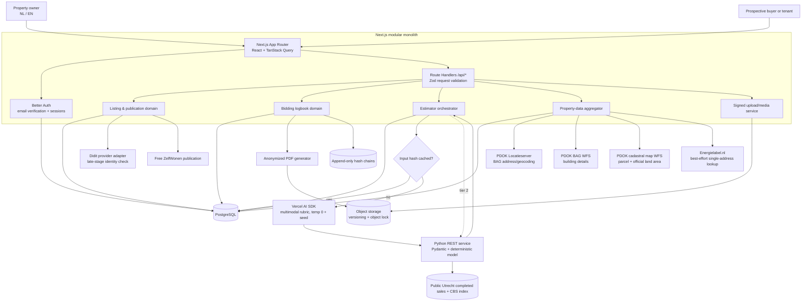
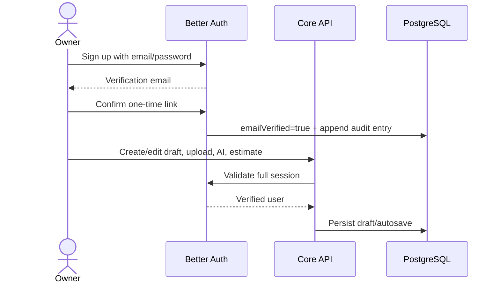
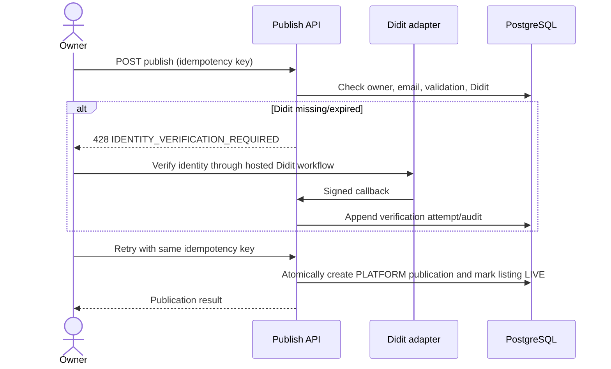
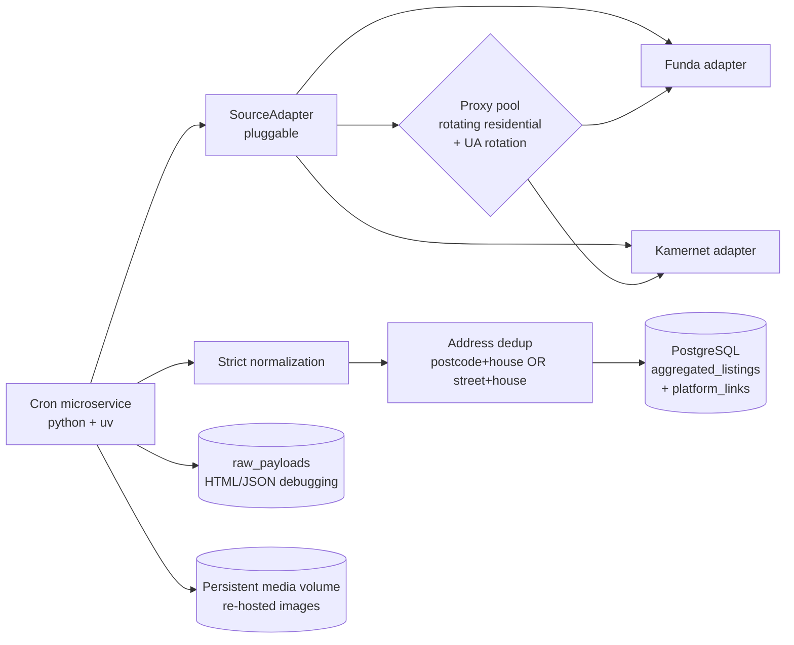

# ZelfWonen platform architecture

## Goals and trust boundaries

ZelfWonen is a bilingual self-service sales/rental platform. The Next.js application is a modular monolith for transactional workflows; deterministic comparable-sales valuation runs in an isolated Python service; and a second isolated Python/uv cron microservice (`aggregator/`) ingests external listings. External providers are hidden behind adapters.

The strategic direction is shifting from **publishing** listings outward to
**aggregating** listings inward from Funda and Kamernet (see "Inbound listing
aggregator" below).

Two verification gates are deliberately separate:

1. **Email gate:** Better Auth requires a verified email before any listing, upload, AI, address-data, or estimator endpoint is usable.
2. **Publication gate:** Didit is requested only when an owner tries to move a draft to `LIVE` . A current successful attempt linked to that owner is required in the same publication transaction.

## High-level system architecture

## Core request flows

### Draft access

Every protected route repeats the server-side session and `emailVerified` check. Proxy-level cookie checks may improve navigation UX but are never authorization.

### Publish transition and Didit gate

Callbacks validate the raw-body signature and signed timestamp, then fetch the authoritative session decision. Session, workflow, environment and local account binding must match. Store only references, status, timestamps, expiry and a response-projection hash; documents and biometrics are not persisted. Successful verification is cached per user for 365 days by default and reused across listings. The retired iDIN endpoints return HTTP 410, and identity verification cannot sign an agreement.

### Hybrid estimator

Normalized property fields, owner text, sorted image hashes, the condition rubric version and current model/data version determine the cache key. A valid 24-hour cache hit bypasses vision and prediction after checking model readiness. Response metadata is stored alongside normalized input in the existing JSON column.

- Authorized uploaded photos are assessed on the fixed 1–5 rubric. Unseen dimensions are null. Vision failure falls back to quantitative inputs.
- Python selects 5–20 similar local completed sales using published coordinates around a known postcode sector, property type, floor area, rooms, construction year and recency. Anonymized data excludes the subject’s full postcode. A CBS monthly index adjusts sale prices to a common valuation month; a weighted median produces the base price.
- Visible-condition adjustments are confidence-weighted and bounded at ±4%. They are explicit heuristics, not learned renovation returns, and cannot increase reported confidence.
- When local evidence is insufficient, an optional property WOZ assessment takes precedence over official municipal median WOZ per m². CBS provincial/city quarterly indices and national monthly movement update the reference value. PDOK verifies the address and supplies exact coordinates, municipality and province; these resolved fields also enter the cache key.
- Residentievinder asking-price medians only flag disagreement and widen bounds. They do not change the central estimate or act as completed-sale labels. WOZ methods apply no photo premiums and report zero comparables.
- Missing or stale artifacts, unverified addresses and unsupported properties produce an unavailable estimate.

Outputs include euro cents, heuristic bounds, method, source links, warnings, comparable count, reference and valuation months, image adjustment and version. They are indicative, not a certified valuation. All 342 municipalities have a statistical fallback; transaction-price accuracy is not nationally validated. Free datasets ship in the image; no paid export is required. See [estimator method and limitations](../../estimator/METHOD.md).

## Data/integration decisions

### Kadaster and BAG

PDOK Locatieserver resolves addresses and BAG identifiers. The public PDOK BAG WFS supplies building details, and the PDOK cadastral map WFS supplies parcel land area when the address resolves to a single parcel. These lookups do not require Kadaster API credentials. Stored parcel identifiers and land areas take precedence over live parcel results.

### Energy labels

The request path performs a best-effort single-address Energielabel.nl lookup and falls back to the latest known non-unknown energy label in the local database. No EP-Online ingestion worker or API credentials are used. Existing source metadata is retained for stored labels.

### Floor plans and media

- Static floor plans accept PNG/JPEG/PDF through signed uploads. MIME sniffing, malware scanning, image transcoding, size limits, SHA-256, and EXIF removal happen before `READY`.
- Floorplanner embeds use an allowlisted host and project identifier. The platform stores no untrusted arbitrary iframe HTML.

### Free platform publication

Owner listings are published only on ZelfWonen, with no payment or package selection. The email and Didit gates remain required. Legacy order/package columns are retained for historical records and are not populated by new publications. The external publisher adapter and checkout endpoint have been removed.

## Inbound listing aggregator

ZelfWonen no longer pushes listings out to portals. Instead a dedicated Python
cron microservice (repo root `aggregator/`, managed with `uv`) scrapes, parses,
normalizes and deduplicates rental/sale listings **from** Funda and Kamernet
into a centralized discovery layer. More sources plug in through a single
`SourceAdapter` interface.

Key decisions:

- **Resilience:** rotating residential proxies and User-Agent rotation with
  exponential backoff, jitter and a polite delay. A scrape that runs longer than
  the 6-hour interval is prevented from overlapping itself by a PostgreSQL
  advisory lock.
- **Normalization:** chaotic HTML/JSON is mapped onto one strict internal schema
  (`aggregator/app/models.py`). The web app only ever reads normalized rows.
- **Images:** source images are downloaded and re-hosted in a persistent VM volume
  (optionally S3/R2) and served through our own domain; source images
  are never hotlinked.
- **Deduplication:** the same property listed on Funda and Kamernet with
  different IDs merges into one `AggregatedListing` master by
  `postcode + house number` OR `street + house number`. Every direct link is
  kept in `aggregated_platform_links` so the UI can show branded outbound links.
- **Incremental + expiry:** only listings whose summary (price/status/title)
  changed are fully re-fetched; raw responses land in `raw_payloads`. A listing
  that 404s or disappears from a sitemap is marked `OFFLINE`/`EXPIRED` — never
  deleted — preserving historical data.

Aggregated properties are an **informational discovery layer only**: bidding,
viewing appointments and the transaction always happen on the original
platform. The `/property/[slug]` page renders aggregated listings with branded
links back to Funda/Kamernet and no platform bidding/viewing UI.

Scraping Funda and Kamernet is adversarial and may conflict with their terms;
lawful access (licensed feeds or contractual agreement) and image-hosting rights
must be confirmed with counsel before production use.

## Biedlogboek integrity

A bid contains the amount in integer euro cents, UTC submission time, bidder pseudonym, and typed resolutive conditions. Bid rows, status events, verification audit rows, and aggregate audit rows are append-only.

Integrity controls:

1. Acquire a PostgreSQL transaction advisory lock per listing.
2. Canonicalize the event payload and chain `SHA-256(previousHash + payload)`.
3. Database triggers reject `UPDATE` and `DELETE` for immutable tables.
4. Export an anonymized PDF after finalization; persist its SHA-256 and chain head.
5. Store the PDF in the private `web_data` volume and return it through the authorized logbook API. Object-lock/WORM archival is future production hardening.
6. Keep bidder identity/contact data separate from the shareable document and apply retention/deletion policies under GDPR.

Hash chains make alteration evident; they do not by themselves prevent a privileged database administrator from replacing all data. Production should additionally use restricted database roles, off-site signed checkpoints/WORM audit storage, backups, key management, and monitored access.

The exact legal status and required contents of a bidding logbook can depend on seller type, trade-association rules, contract terms, and evolving Dutch law. Dutch counsel and a privacy officer must approve the workflow, anonymization, recipient definition, retention, and PDF wording before launch.

## Transaction room and property passport

Accepting a bid atomically changes the listing to `UNDER_OFFER`, creates a two-party transaction room, seeds the sale/rental milestones, and records the first property-passport version. Only the accepted bidder and listing owner may access that room.

The room covers:

- buyer/seller chat with private PDF/image attachments;
- structured agreement terms and separate confirmations by both parties;
- financing, inspection, deposit, notary, transfer, final-inspection and key-handover milestones;
- notary contact/reference data, meter readings, keys and handover notes;
- generated agreement and property-passport PDFs in the private document vault;
- cancellation back to `LIVE`, or controlled completion to `SOLD` / `RENTED`;
- append-only, hash-chained transaction events and passport versions.

Property-passport snapshots include listing/property data, source records, media hashes and the listing version. Each passport version stores the preceding hash and its own canonical SHA-256 hash. The PDF includes the version hash and a separate snapshot hash so recipients can identify the exact dossier version.

Both development and the single-VM portfolio deployment store transaction documents outside `public/` under `.data/transaction-documents`; Docker persists them in `web_data`. Downloads require a verified session and room membership. The shared storage module also handles listing uploads, generated PDFs and logbooks; Caddy only mounts public media volumes. The estimator reads authorized photo bytes directly, so no object-storage URL is required. See [deployment and backups](deployment.md). Production hardening for real transactions includes malware scanning, encryption, retention policy and immutable archival. Platform confirmation records intent and agreed terms, but is not a qualified electronic signature. Connect an eIDAS-capable signing provider and complete Dutch legal review before representing generated agreements as signed purchase or rental contracts.

## Personal seeker dashboard

The verified-user dashboard at `/dashboard/seeker` combines favorites, saved searches, viewings, bids, transactions and an in-app notification inbox. Marketplace favorites remain usable anonymously in local storage; after sign-in, the client imports and merges them into account-scoped `FavoriteListing` records without discarding newer local choices.

Saved searches store only canonical, validated marketplace query parameters and are unique per user and normalized query. Notification generation is deliberately separate from dashboard reads: the client invokes an authenticated sync endpoint once per browser session, while the dashboard GET remains a predictable read. The sync creates idempotent events for new search matches, favorite price/status changes, viewings, bids, transaction changes and upcoming deadlines. A production scheduler may invoke the same service for timely notifications when users are offline.

Shortlists use random bearer tokens whose SHA-256 hashes are stored in PostgreSQL. Shared pages expose listing summaries but no owner identity. Links expire, can be revoked, and include private favorite notes only after the owner explicitly opts in for that individual share. The comparison feature is intentionally outside this dashboard scope.

## Security and operations baseline

- Validate all request/response contracts with Zod; use Pydantic against the same OpenAPI contract in Python.
- Use integer cents, UTC timestamps, UUID primary keys, optimistic listing versions, idempotency keys, and database constraints.
- Encrypt secrets in managed secret storage; separate production/staging provider credentials.
- Rate-limit auth, AI, estimate, upload, Didit start/webhook, publication, and bid endpoints.
- Use CSRF/origin protection, CSP/frame allowlists, signed callbacks, SSRF-safe media resolution, malware scanning, and PII-redacted structured logs.
- Apply GDPR purpose limitation, data minimization, retention schedules, data-subject workflows, processor agreements, and EU-region storage.
- Track SLOs and fallback-tier rates. Alert when Tier 3 usage, failed publications, callback signature failures, or audit-chain validation errors rise.
