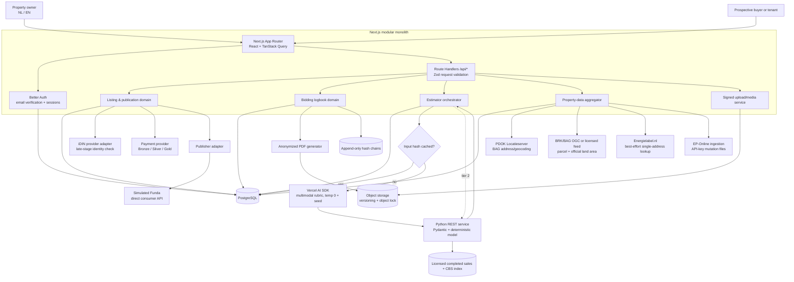
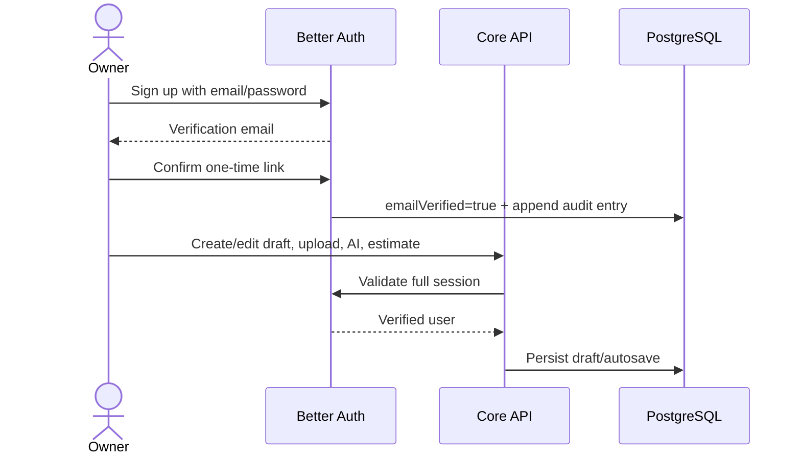
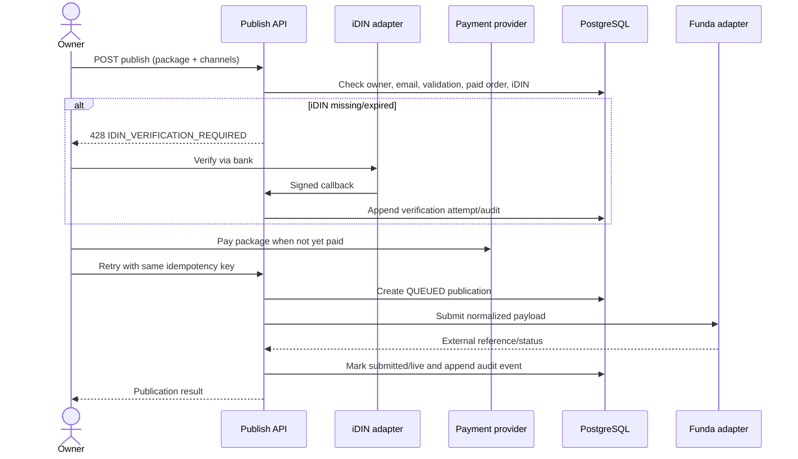
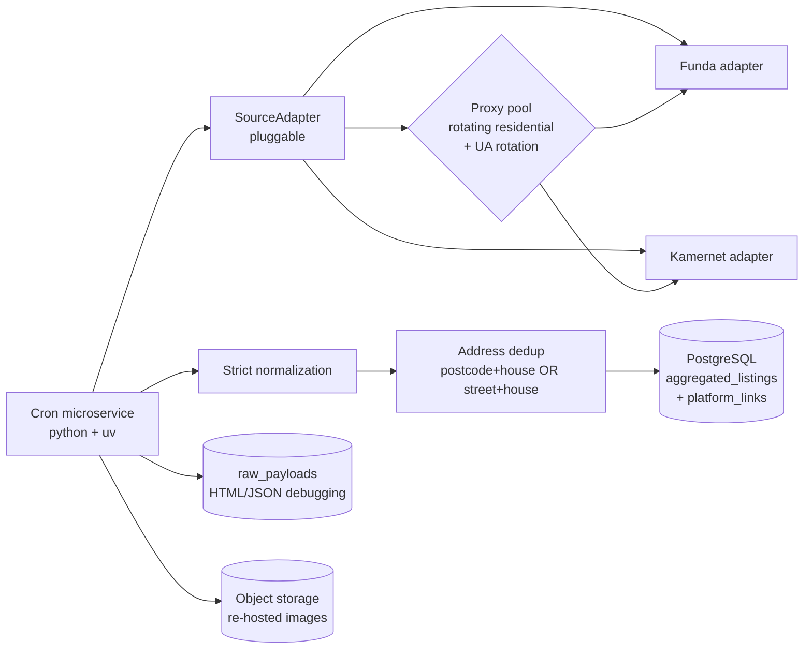

# ZelfWonen platform architecture

## Goals and trust boundaries

ZelfWonen is a bilingual self-service sales/rental platform. The Next.js application is a modular monolith for transactional workflows; deterministic price regression runs in an isolated Python service; and a second isolated Python/uv cron microservice (`aggregator/`) ingests external listings. External providers are hidden behind adapters.

The strategic direction is shifting from **publishing** listings outward to
**aggregating** listings inward from Funda and Kamernet (see "Inbound listing
aggregator" below).

Two verification gates are deliberately separate:

1. **Email gate:** Better Auth requires a verified email before any listing, upload, AI, address-data, or estimator endpoint is usable.
2. **Publication gate:** iDIN is requested only when an owner tries to move a draft to `LIVE` or publish externally. A current successful attempt linked to that owner/listing is required in the same publication transaction.

## High-level system architecture

## Core request flows

### Draft access

Every protected route repeats the server-side session and `emailVerified` check. Proxy-level cookie checks may improve navigation UX but are never authorization.

### Publish transition and iDIN gate

Callbacks must validate provider signatures, issuer, audience, expiry, nonce, and replay protection. Do not store BSN or raw bank assertions. Store a salted provider-subject hash, match flags, provider reference, status, timestamps, and a raw-payload hash.

### Hybrid estimator

Normalized property fields, owner text, sorted image hashes, the condition rubric version and current model/data version determine the cache key. A valid 24-hour cache hit bypasses vision and prediction after checking model readiness. Response metadata is stored alongside normalized input in the existing JSON column.

- Authorized uploaded photos are assessed on the fixed 1–5 rubric. Unseen dimensions are null. Vision failure falls back to quantitative inputs.
- Python selects 5–20 similar local completed sales using postcode sector, property type, floor area, rooms, construction year and recency. A CBS monthly index adjusts sale prices to a common valuation month; a weighted median produces the base price.
- Visible-condition adjustments are confidence-weighted and bounded at ±4%. They are explicit heuristics, not learned renovation returns, and cannot increase reported confidence.
- Missing sales artifacts or insufficient local evidence produce an unavailable estimate. The postcode-statistic and emergency-price fallbacks have been removed.

Outputs include euro cents, heuristic bounds, comparable count, valuation month, image adjustment and version. They are indicative, not a certified valuation. The public CBS index is bundled; a licensed Dutch completed-sales artifact still needs to be imported. See [estimator setup and limitations](../../estimator/README.md).

## Data/integration decisions

### Kadaster and BAG

PDOK Locatieserver is an open geocoder and is suitable for resolving addresses and BAG identifiers. It is not the authoritative source for every parcel attribute. Official parcel geometry/land area should be obtained from the applicable BRK/BAG OGC API or licensed Kadaster product, normalized by a background sync, and stored with source timestamps and payload provenance.

### EP-Online

RVO EP-Online exposes public-data delivery for registered labels and performance indicators; access to automated mutation files requires an API key. A scheduled ingestion worker should download/validate mutations and upsert address-level label snapshots. The request path reads the local normalized mirror to avoid coupling the wizard to a bulk-feed outage. Confirm current RVO terms, fields, retention, and redistribution rights before production.

### Floor plans and media

- Static floor plans accept PNG/JPEG/PDF through signed uploads. MIME sniffing, malware scanning, image transcoding, size limits, SHA-256, and EXIF removal happen before `READY`.
- Floorplanner embeds use an allowlisted host and project identifier. The platform stores no untrusted arbitrary iframe HTML.
- Publishing uses short-lived signed URLs or provider-side media transfer; the public-base URL in the scaffold is only an adapter seam.

### Simulated Funda layer (deprecated)

> **Deprecated.** Push-publishing listings to Funda/Kamernet is being
> abandoned in favour of the inbound aggregator described below. The existing
> `ListingPublisher` port, `FundaPublisher` simulated adapter, publication
> orders and iDIN publication gate remain only for compatibility and are no
> longer a product direction.

## Inbound listing aggregator

ZelfWonen no longer pushes listings out to portals. Instead a dedicated Python
cron microservice (repo root `aggregator/`, managed with `uv`) scrapes, parses,
normalizes and deduplicates rental/sale listings **from** Funda and Kamernet
into a centralized discovery layer. More sources plug in through a single
`SourceAdapter` interface.

Key decisions:

- **Resilience:** rotating residential proxies and User-Agent rotation with
  exponential backoff, jitter and a polite delay. A scrape that runs longer than
  the 6-hour interval is prevented from overlapping itself by a PostgreSQL
  advisory lock.
- **Normalization:** chaotic HTML/JSON is mapped onto one strict internal schema
  (`aggregator/app/models.py`). The web app only ever reads normalized rows.
- **Images:** source images are downloaded and re-hosted in platform-controlled
  object storage (S3/R2) and served through our own CDN/domain; source images
  are never hotlinked.
- **Deduplication:** the same property listed on Funda and Kamernet with
  different IDs merges into one `AggregatedListing` master by
  `postcode + house number` OR `street + house number`. Every direct link is
  kept in `aggregated_platform_links` so the UI can show branded outbound links.
- **Incremental + expiry:** only listings whose summary (price/status/title)
  changed are fully re-fetched; raw responses land in `raw_payloads`. A listing
  that 404s or disappears from a sitemap is marked `OFFLINE`/`EXPIRED` — never
  deleted — preserving historical data.

Aggregated properties are an **informational discovery layer only**: bidding,
viewing appointments and the transaction always happen on the original
platform. The `/property/[slug]` page renders aggregated listings with branded
links back to Funda/Kamernet and no platform bidding/viewing UI.

Scraping Funda and Kamernet is adversarial and may conflict with their terms;
lawful access (licensed feeds or contractual agreement) and image-hosting rights
must be confirmed with counsel before production use.

## Biedlogboek integrity

A bid contains the amount in integer euro cents, UTC submission time, bidder pseudonym, and typed resolutive conditions. Bid rows, status events, verification audit rows, and aggregate audit rows are append-only.

Integrity controls:

1. Acquire a PostgreSQL transaction advisory lock per listing.
2. Canonicalize the event payload and chain `SHA-256(previousHash + payload)`.
3. Database triggers reject `UPDATE` and `DELETE` for immutable tables.
4. Export an anonymized PDF after finalization; persist its SHA-256 and chain head.
5. Store the PDF in object storage with retention/object-lock and share time-limited links with eligible active bidders.
6. Keep bidder identity/contact data separate from the shareable document and apply retention/deletion policies under GDPR.

Hash chains make alteration evident; they do not by themselves prevent a privileged database administrator from replacing all data. Production should additionally use restricted database roles, off-site signed checkpoints/WORM audit storage, backups, key management, and monitored access.

The exact legal status and required contents of a bidding logbook can depend on seller type, trade-association rules, contract terms, and evolving Dutch law. Dutch counsel and a privacy officer must approve the workflow, anonymization, recipient definition, retention, and PDF wording before launch.

## Transaction room and property passport

Accepting a bid atomically changes the listing to `UNDER_OFFER`, creates a two-party transaction room, seeds the sale/rental milestones, and records the first property-passport version. Only the accepted bidder and listing owner may access that room.

The room covers:

- buyer/seller chat with private PDF/image attachments;
- structured agreement terms and separate confirmations by both parties;
- financing, inspection, deposit, notary, transfer, final-inspection and key-handover milestones;
- notary contact/reference data, meter readings, keys and handover notes;
- generated agreement and property-passport PDFs in the private document vault;
- cancellation back to `LIVE`, or controlled completion to `SOLD` / `RENTED`;
- append-only, hash-chained transaction events and passport versions.

Property-passport snapshots include listing/property data, source records, media hashes and the listing version. Each passport version stores the preceding hash and its own canonical SHA-256 hash. The PDF includes the version hash and a separate snapshot hash so recipients can identify the exact dossier version.

Development stores transaction documents outside `public/` under `.data/transaction-documents`; downloads require a verified session and room membership. Production must replace local storage with EU-region private object storage, malware scanning, MIME/content verification, encryption, retention policy and immutable versioning/object lock. Platform confirmation records intent and agreed terms, but is not a qualified electronic signature. Connect an eIDAS-capable signing provider and complete Dutch legal review before representing generated agreements as signed purchase or rental contracts.

## Personal seeker dashboard

The verified-user dashboard at `/dashboard/seeker` combines favorites, saved searches, viewings, bids, transactions and an in-app notification inbox. Marketplace favorites remain usable anonymously in local storage; after sign-in, the client imports and merges them into account-scoped `FavoriteListing` records without discarding newer local choices.

Saved searches store only canonical, validated marketplace query parameters and are unique per user and normalized query. Notification generation is deliberately separate from dashboard reads: the client invokes an authenticated sync endpoint once per browser session, while the dashboard GET remains a predictable read. The sync creates idempotent events for new search matches, favorite price/status changes, viewings, bids, transaction changes and upcoming deadlines. A production scheduler may invoke the same service for timely notifications when users are offline.

Shortlists use random bearer tokens whose SHA-256 hashes are stored in PostgreSQL. Shared pages expose listing summaries but no owner identity. Links expire, can be revoked, and include private favorite notes only after the owner explicitly opts in for that individual share. The comparison feature is intentionally outside this dashboard scope.

## Security and operations baseline

- Validate all request/response contracts with Zod; use Pydantic against the same OpenAPI contract in Python.
- Use integer cents, UTC timestamps, UUID primary keys, optimistic listing versions, idempotency keys, and database constraints.
- Encrypt secrets in managed secret storage; separate production/staging provider credentials.
- Rate-limit auth, AI, estimate, upload, iDIN start/callback, publication, and bid endpoints.
- Use CSRF/origin protection, CSP/frame allowlists, signed callbacks, SSRF-safe media resolution, malware scanning, and PII-redacted structured logs.
- Apply GDPR purpose limitation, data minimization, retention schedules, data-subject workflows, processor agreements, and EU-region storage.
- Track SLOs and fallback-tier rates. Alert when Tier 3 usage, failed publications, callback signature failures, or audit-chain validation errors rise.
